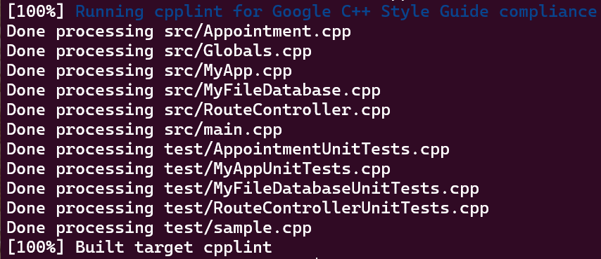
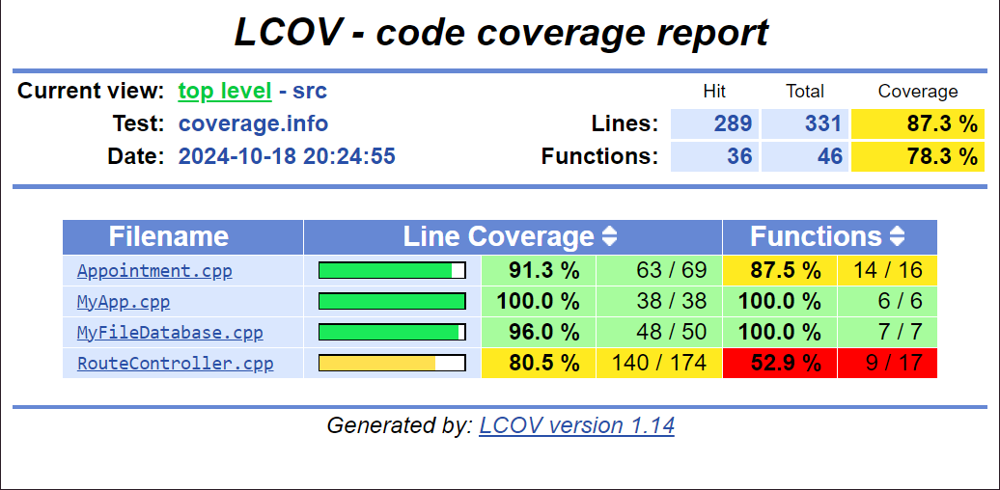
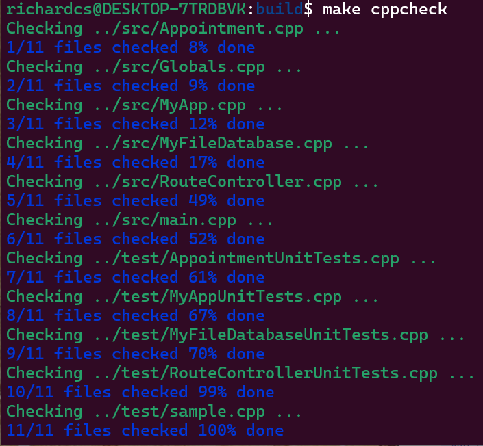

Team Name: CVNPlusOne

# COMS-4156-Project
This is the GitHub repository for the project associated with COMS 4156 Advanced Software Engineering. 

# The Service
## Building and Running a Local Instance
In order to build and use the service you must install the following (assuming an Ubuntu install):

1. CLang 3.30
2. ASIO library
3. Crow library
4. Boost library
5. Crow and Boost libraries should be extracted to the "external_libraries" folder.

## Running a Cloud based Instance
You can run a cloud-based instance of this service by spinning up a Compute Engine VM, and then installing as if it were a local instance.

## Running Tests
The unit tests are located under the directory 'test'. To run the projects unit tests, you must first build the project.

Running 'make' will build both the program binary and the test binary. You can execute the test binary to see the outcome of the tests.

## Endpoints
This section describes the endpoints that the service provides, as well as their inputs and outputs. 

#### GET /retrieveAppt
* Expected Input Parameters: apptCode
* Expected Output: appointment details
* Upon Success: HTTP 200 Status Code is returned along with appointment details in the response body
* Upon Failure: HTTP 404 Status Code is returned along with "Appointment Not Found" in the response body. 

#### DELETE /deleteAppt
* Expected Input Parameters: apptCode
* Expected Output: "Appointment deleted successfully"
* Upon Success: HTTP 200 Status Code is returned along with 
"Appointment deleted successfully" in the response body
* Upon Failure: HTTP 404 Status Code is returned along with "Appointment Not Found" in the response body. 

#### PUT /createAppt
* Expected Input Parameters: title startTime endTime location
* Expected Output: apptCode
* Upon Success: HTTP 201 Status Code is returned along with appointment code in the response body
* Upon Failure: HTTP 404 Status Code is returned along with "Appointment Exists :" and details of appointment in the response body. 
* If title param is missing, HTTP 400 Status Code is returned along with "Missing appointment title" in the response body
* If startTime is missing, HTTP 400 Status Code is returned along with "Missing appointment startTime" in the response body
* If endTime is missing, HTTP 400 Status Code is returned along with "Missing appointment endTime" in the response body
* If location is missing, HTTP 400 Status Code is returned along with "Missing appointment location" in the response body

#### PATCH /updateApptTitle
* Expected Input Parameters: apptCode apptTitle
* Expected Output: "Appointment title successfully updated."
* Upon Success: HTTP 200 Status Code is returned along with "Appointment title successfully updated." in the response body.
* Upon Failure: HTTP 404 Status Code is returned along with "Appointment Not Found" in the response body. 

#### PATCH /updateApptLocation
* Expected Input Parameters: apptCode apptLocation
* Expected Output: "Appointment location successfully updated."
* Upon Success: HTTP 200 Status Code is returned along with "Appointment location successfully updated." in the response body.
* Upon Failure: HTTP 404 Status Code is returned along with "Appointment Not Found" in the response body. 

#### PATCH /updateApptTimes
* Expected Input Parameters: apptCode startTime endTime
* Expected Output: "Appointment time successfully updated."
* Upon Success: HTTP 200 Status Code is returned along with "Appointment time successfully updated." in the response body.
* Upon Failure: HTTP 404 Status Code is returned along with "Appointment Not Found" or HTTP 400 Status Code is returned along with "Failed to update appointment time." in the response body. 

## Database
* For first iteration we have set up testfile.bin. On calling `IndividualMiniproject setup`, db entries will be setup. On subsequent calls to IndividualMiniproject without `setup`, it reads the appointments from the db. On termination it writes the appointments created into the db.
* For second iteration we have added a framework for connection to a MySQL database. The MySQL database must run on the same server as the main program. 
* The password for the root user of the MySQL database must be stored in a file named "database.txt" in the build directory. 
* The MySQL database must have a schema named "ase", and a table in that schema called "appointment".
* The appointment table has the following CREATE TABLE statement:
CREATE TABLE `appointment` (
  `id` varchar(150) NOT NULL,
  `title` varchar(150) NOT NULL,
  `location` varchar(150) NOT NULL,
  `createdBy` varchar(150) NOT NULL,
  `participantId` varchar(150) NOT NULL,
  `start_time` datetime NOT NULL,
  `end_time` datetime NOT NULL,
  PRIMARY KEY (`id`)
)

## Integration Tests
We tested the integration of the service with the MySQL database via the tests in the ApptDatabaseUnitTests class.

For the second iteration we have used MySQL.

## Style Checking Report
The cpplint tool was used to check the style of the code.

## Branch Coverage Reporting
The lcov tool was used to to perform branch analysis in order to see the branch coverage of the relevant code within the code base.

## Static Code Analysis
The cppcheck tool was used to perform static analysis on the codebase.

## Continuous Integration Report
We are using GitHub Actions to perform continous integration. 

## Tools used
We use Postman for API testing, and Github Issue for project management purpose

# The Client
## Building and Running a Local Instance
In order to build and use the service you must install the following (assuming an Ubuntu install):

1. restclient-cpp and
2. JsonCpp library

To run the Doctor Client:
1. cd DoctorClient/build
2. ./DoctorClient

To run the Patient Client:
1. cd PatientClient/build
2. ./PatientClient

## Running a Cloud based Instance
You can run a cloud-based instance of the client by spinning up a Compute Engine VM, and then installing as if it were a local instance.

## Client CLI
The Doctor and Patient Clients manage the appointments by CLI. The CLI starts by asking for the base URL of the Service. Then it gives the options for the Client to selct from.
 
### The base URL prompt:
Enter the base URL (default: http://127.0.0.1:8080): 
Using local base URL http://127.0.0.1:8080

If the base URL is not entered the default for the local machine is taken.
The options are different for the Doctor and Patient Clients. The Doctor can create, update, view and delete appointments for all Patients. The Patient can only view and delete their own appointments.

### The options

#### DoctorClient
=================
Select an option:
1. Create an appointment
2. Get all appointment codes
3. Get details for a specific appointment
4. Get details for all appointments
5. Update title of an appointment
6. Update location of an appointment
7. Update start and end times of an appointment
8. Delete an appointment
9. Exit
Enter your choice: 

#### PatientClient
=================
Select an option:
1. Get all appointment codes
2. Get details for a specific appointment
3. Get details for all appointments
4. Delete an appointment
5. Exit

## Examples
### Create Appointment (Doctor Client only)
Enter your choice: 1
Enter appointment title: Office visit
Enter start time (UNIX timestamp): 1730383200
Enter end time (UNIX timestamp): 1730383800
Enter appointment location: Health Center
http://127.0.0.1:8080/createAppt?title=Office%20visit&startTime=1730383200&endTime=1730383800&location=Health%20Center
Appointment Created : aptCode APPT4

### View Appointment (Both Doctor and Patient Clients)
Enter your choice: 2(Doctor) OR 1(Patient)
Available Appointment Codes: 
APPT4

### Update Appointment (Doctor Client only)
Enter your choice: 5
Enter appointment code: APPT4
Enter appointment title: Blood test
http://127.0.0.1:8080/updateApptTitle?apptCode=APPT4&apptTitle=Blood%20test
Appointment APPT4 updated successfully

Similarly for Update location and Update start and end times.

### Delete Appointment (Both Doctor and Patient Clients)
Enter your choice: 8(Doctor) OR 4(Patient)
Enter appointment code: APPT4
Appointment APPT4 deleted successfully

# End to End Testing
End to end testing involves all components in our system - the Service, the REST APIs, the DB and the Clients.
We have two categories of Clients. The first are Medical and Emergency service providers. We call them the "Doctor" client.
The second category is the Elderly and/or Disabled individuals. We call them the "Patient" client.

Our end to end tests are manual with one Doctor and two Patient clients.

For running these tests please follow the actions in the checklist in the right order and compare the results with the ones provided.

1. Install the following in you system before running the Service and the Clients
On the Server:
* CLang 3.30
* ASIO, Crow and Boost libraries
* MySQL 

On the Client:
* restclient-cpp and
* JsonCpp library

Please look at the instructions above for details on installing.

2. The Service and the Clients can run on the same or different local or remote servers. One or all of them can run on GCP. For details of GCP installation please see instructions above.

3. Start the Service. 
* Please refer to the Server section above for instructions to build and run the Server

4. Start one Doctor and two Patient Clients.
   The Clients can be on same or different machines. 
   The Patient Clients have their own ids and communicate with the Service over REST APIs. So each Client is independent of each other. The Client can only see their own appointments.
   The Doctor Client can create, update and view appointments for all the Patients.

5. Create an appointment from Doctor client for the Patient1. 
   Check if the appointment shows on the Doctor and Patient1. The appointment codes and details should be identical on both.
   

6. Repeat step 3 for Patient2

7. Now check the created appointments of Doctor. It should show appointments for both Patients. However the Patient should only see their own appintments.

8. Update the title, location and times for Patient1 appointment from Doctor. View the appointments on Patient1 and Patient2. Patient1 should show the changed values. Patient2 appointment should be unchanged.

9. Delete the appointment from Patient2. Check the appointments on Doctor. Doctor should see only the Patient1 appointment. 
   Patient1 appointment should show both on Doctor and Patient1.
   Patient2 appointment should be empty.

10. Now create 2 new appointments from Patient2. 
   Check if the new appointments show on Doctor and Patient2.
   Check that the new appointments do not show on Patient1.
   Delete one of the new appointments from Doctor. Check if it has been deleted on Doctor and Patient2. Check if Patient1 appointments are not impacted.
